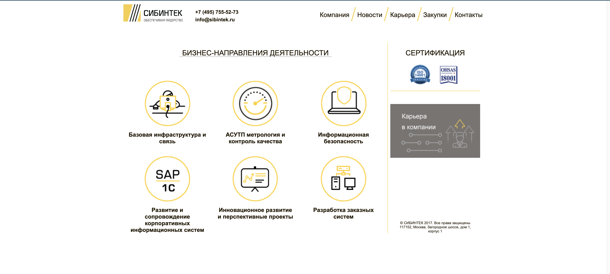
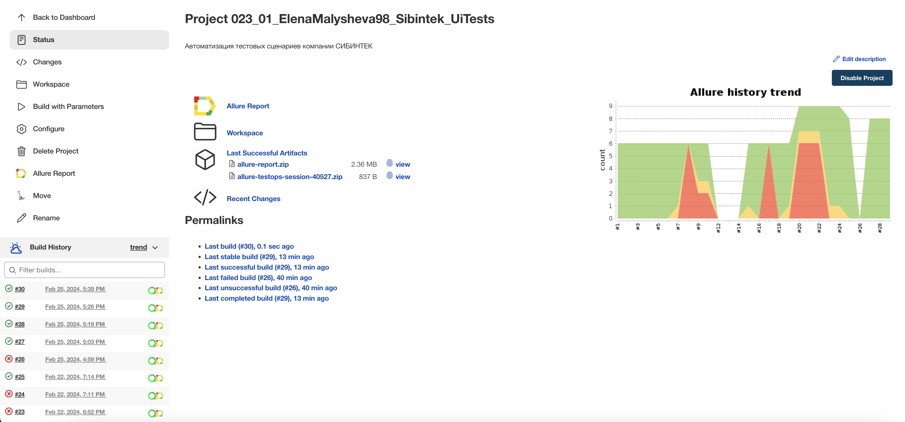
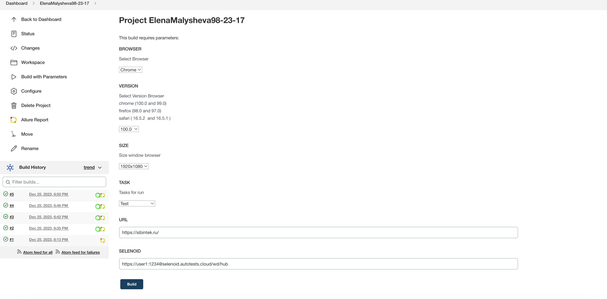
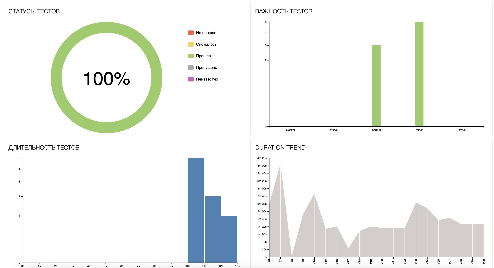
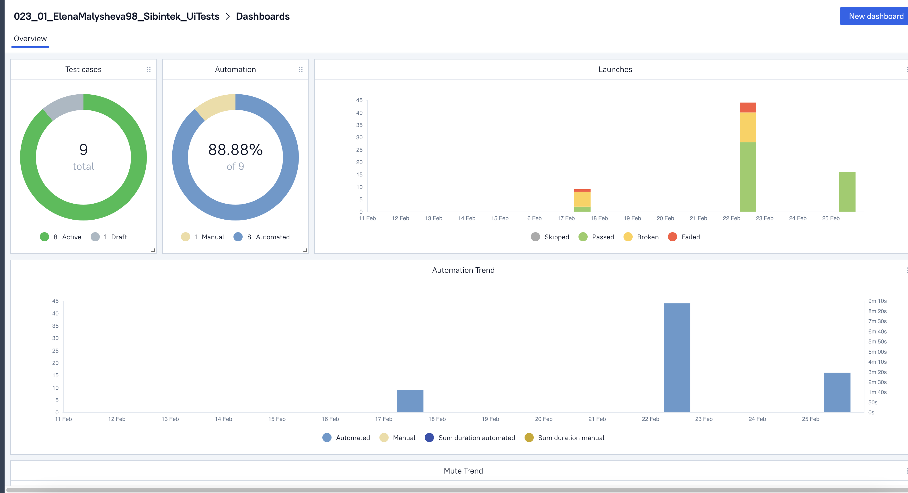
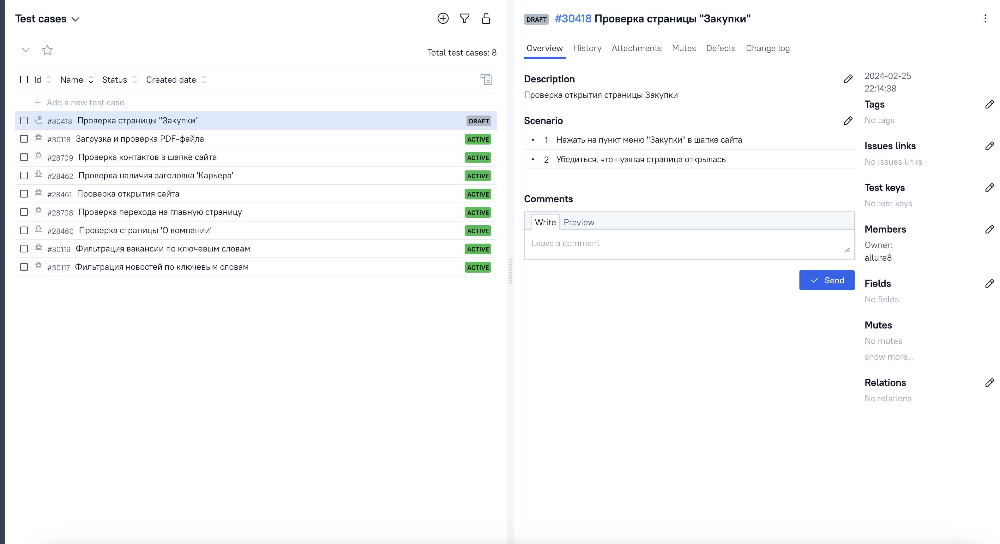
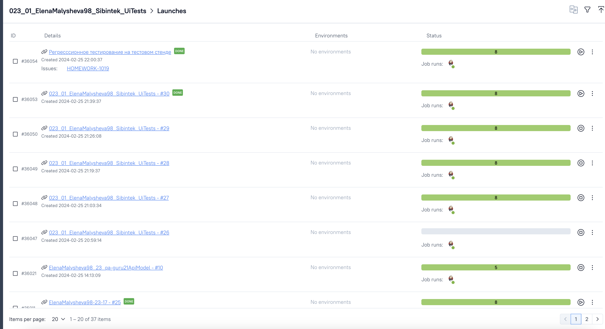
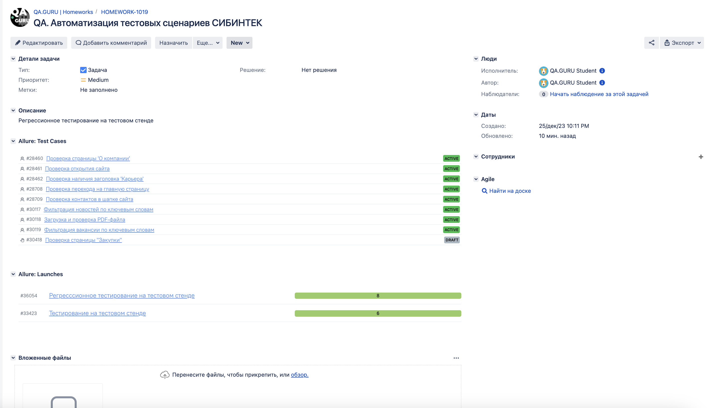
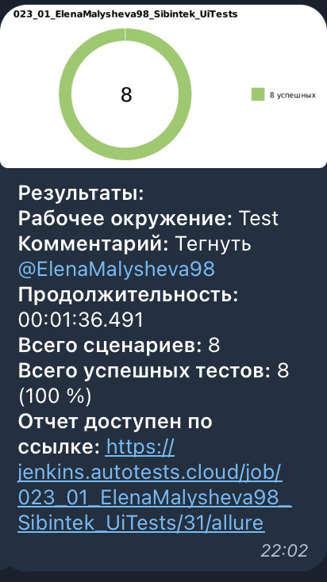
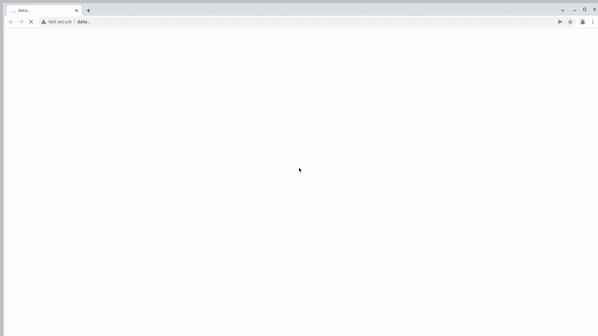

# Проект по автоматизации тестирования для сайта компании [ООО СИБИНТЕК](https://sibintek.ru/) 



<p>ООО ИК «СИБИНТЕК» работает на рынке ИТ-сервиса и аутсорсинга с 1999 года и является одним из лидеров отрасли.
В портфеле компетенций «СИБИНТЕК» представлен широкий спектр услуг сервисного обслуживания предприятий, системной интеграции, автоматизации технологических процессов, разработки и внедрения информационных систем, бизнес-консалтинга и сервисной интеграции, проектной деятельности и бизнес-приложений, комплексного создания ИТ-инфраструктуры и внедрения систем связи.

 </p>

##  Содержание:

- <a href="#tools"> Используемые инструменты</a>
- <a href="#cases"> Тест-кейсы</a>
- <a href="#autotests"> Запуск автотестов</a>
- <a href="#jenkins"> Сборка в Jenkins</a>
- <a href="#allureReport"> Пример Allure-отчета</a>
- <a href="#allure"> Интеграция с Allure TestOps</a>
- <a href="#jira"> Интеграция с Jira</a>
- <a href="#tg"> Уведомления в Telegram с использованием бота</a>
- <a href="#video"> Видео примера запуска тестов в Selenoid</a>

____
<a id="tools"></a>
## Используемые инструменты

<p align="center">
<a href="https://www.java.com/"></a>
<a href="https://selenide.org/"></a>
<a href="https://aerokube.com/selenoid/"></a>
<a href="https://github.com/allure-framework/allure2"></a>
<a href="https://qameta.io/"></a>
<a href="https://gradle.org/"></a>
<a href="https://junit.org/junit5/"></a>
<a href="https://github.com/"></a>
<a href="https://www.jenkins.io/"></a>
<a href="https://web.telegram.org/a/"></a>
<a href="https://www.atlassian.com/ru/software/jira/"></a>
</p>

____
Тесты написаны на языке <code>Java</code> с использованием фреймворка для автоматизации тестирования [Selenide](https://selenide.org/), сборщик - <code>Gradle</code>.

<code>JUnit 5</code> задействован в качестве фреймворка модульного тестирования.
При прогоне тестов для удаленного запуска используется [Selenoid](https://aerokube.com/selenoid/).

Для удаленного запуска реализована джоба в <code>Jenkins</code> с формированием Allure-отчета и отправкой результатов в <code>Telegram</code> при помощи бота.
Также реализована интеграция с <code>Allure TestOps</code> и <code>Jira</code>.


Содержание Allure-отчета для каждого кейса:
* Шаги теста и результат их выполнения
* Скриншот страницы на последнем шаге (возможность визуально проанализировать, почему упал тест)
* Page Source (возможность открыть source страницы в новой вкладке и посмотреть причину падения теста)
* Логи консоли браузера
* Видео выполнения автотеста.
____
<a id="cases"></a>
## :male_detective: Тест-кейсы
Auto:
- ✓ Поиск заголовка "Карьера"
- ✓ Поиск заголовка "О компании"
- ✓ Проверка наличия контактов в шапке сайта
- ✓ Фильтрация вакансий по ключевым словам
- ✓ Загрузка и проверка файла
- ✓ Проверка перехода со страницы бизнес-направлений на главную
- ✓ Проверка открытия ресурса
- ✓ Фильтрация новостей по ключевым словам

Manual:

- ✓ Проверка перехода на страницу закупок
  <a id="autotests"></a>
____
## :arrow_forward: Запуск автотестов

### Запуск тестов из терминала

Локальный запуск.
Из корневой директории проекта выполнить:
```
gradle clean test  запуск всех тестов
gradle clean positive_tests  запуск позитивных тестов
gradle clean negative_tests запуск негативных тестов
```
____
<a id="jenkins"></a>
##  </a> Сборка в <a target="_blank" href="https://jenkins.autotests.cloud/job/ElenaMalysheva98-23-17/"> Jenkins </a>
Для доступа в Jenkins необходима регистрация на ресурсе [Jenkins](https://jenkins.autotests.cloud/)


Для запуска сборки необходимо перейти в раздел <code>Build with parameters</code>, выбрать необходимые параметры и нажать кнопку <code>Build</code>.

###  Параметры сборки в Jenkins:
- TASK (набор тестов для запуска)
- URL (адрес основной страницы тестируемого сайта)
- SELENOID (адрес удаленного сервера, на котором будут выполняться тесты)
- SIZE (размер окна браузера, по умолчанию 1920x1080)
- VERSION (версия браузера, по умолчанию 100.0. Реализован запуск в Firefox на версиях 98.0 и 97.0, а также Chrome 99.0 и 100.0)
- BROWSER (браузер, по умолчанию chrome)
<p align="center">

</p>
<p>После выполнения сборки, в блоке <code>Build History</code> напротив номера сборки появятся значки <code>Allure Report</code> и <code>Allure TestOps</code>, при клике на которые откроется страница с сформированным html-отчетом и тестовой документацией соответственно.</p>

## 🔖: Тест-сюиты


## :bar_chart: Графики



____
<a id="allureReport"></a>
##  </a> Пример <a target="_blank" href="https://jenkins.autotests.cloud/job/023_01_ElenaMalysheva98_Sibintek_UiTests/31/allure/"> Allure-отчета </a>


<p align="center">

</p>

____
<a id="allure"></a>
##  </a> Интеграция с <a target="_blank" href="https://allure.autotests.cloud/project/3903/dashboards"> Allure TestOps </a>

На *Dashboard* в <code>Allure TestOps</code> видна статистика количества тестов: сколько из них добавлены и проходятся вручную, сколько автоматизированы. Новые тесты, а так же результаты прогона приходят по интеграции при каждом запуске сборки.

<p align="center">

</p>

## 🕸️ Тест-план дипломного проекта


## 📑 Тест-кейсы дипломного проекта



## 🚀 Запуски дипломного проекта


____
<a id="jira"></a>
##  </a> Интеграция с <a target="_blank" href="https://jira.autotests.cloud/browse/HOMEWORK-1019"> Jira </a>

Реализована интеграция <code>Allure TestOps</code> с <code>Jira</code>, в задаче отображается, какие тест-кейсы были написаны в рамках задачи и результат их прогона.

<p align="center">

</p>

____
<a id="tg"></a>
##  Уведомления в Telegram с использованием бота

После завершения сборки, бот, созданный в <code>Telegram</code>, автоматически обрабатывает и отправляет сообщение с отчетом о прогоне тестов в специально настроенный чат.

<p align="center">

</p>

____
<a id="video"></a>
##  Видео примера запуска тестов в Selenoid

В отчетах Allure для каждого теста прикреплен не только скриншот, но и видео прохождения теста
<p align="center">
  
</p>
